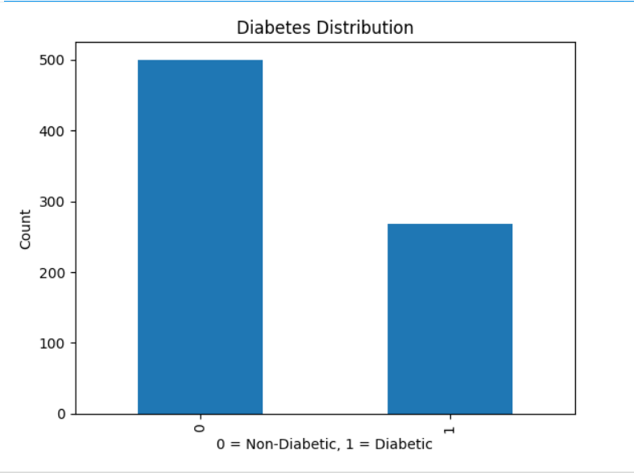
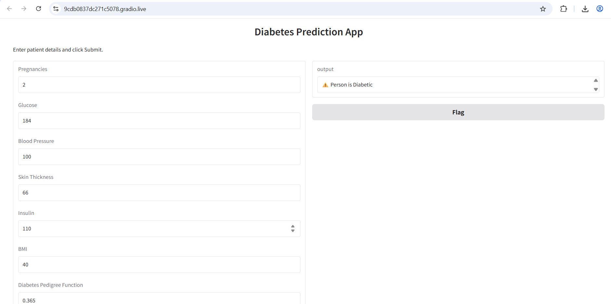

# Diabetes Prediction using Machine Learning

## Project Overview

This project predicts whether a person is diabetic or non-diabetic using Machine Learning.

The model is trained on the PIMA Indians Diabetes Dataset and uses a Support Vector Machine (SVM) classifier to make predictions based on health-related parameters.

## Dataset

Dataset: PIMA Indians Diabetes Dataset

Features:

- Pregnancies
- Glucose
- Blood Pressure
- Skin Thickness
- Insulin
- BMI
- Diabetes Pedigree Function
- Age

Target:

- 0 = Non-Diabetic
- 1 = Diabetic

## Technologies Used

- Python
- Google Colab
- NumPy
- Pandas
- Scikit-Learn
- Matplotlib
- Gradio

## Machine Learning Workflow

### 1. Data Collection and Analysis

- Loaded the PIMA Diabetes Dataset
- Explored dataset structure
- Checked feature distribution

### 2. Data Preprocessing

- Feature scaling using StandardScaler
- Data preparation for model training

### 3. Train-Test Split

Dataset divided into:

- Training Data
- Testing Data

### 4. Model Training

Algorithm Used:

**Support Vector Machine (SVM)**

```python
classifier = svm.SVC(kernel='linear')
```

### 5. Model Evaluation

Model Accuracy:

- Training Accuracy: ~78%
- Testing Accuracy: ~77%

### 6. Data Visualization

A bar chart was added to visualize the distribution of diabetic and non-diabetic patients.

## Web Application

An interactive Diabetes Prediction Web App was created using Gradio.

Users can enter:

- Pregnancies
- Glucose
- Blood Pressure
- Skin Thickness
- Insulin
- BMI
- Diabetes Pedigree Function
- Age

The application instantly predicts whether the person is diabetic or not.

## Project Screenshots

### Diabetes Distribution Graph



### Diabetes Prediction Web Application



## Demo Video

Watch Project Demonstration:

[Project Demo Video](PASTE_VIDEO_LINK_HERE)

## Repository Structure

```
Task-01-Diabetes-Prediction/
│
├── Diabetes_Prediction_Ananya_Hebbar.ipynb
├── diabetes.csv
├── README.md
├── graph.png
└── webapp.png
```

## Results

- Successfully trained an SVM classification model
- Achieved approximately 77% prediction accuracy
- Added data visualization
- Developed an interactive web application using Gradio

## Author

Ananya Hebbar

AI/ML Intern – InternPe
