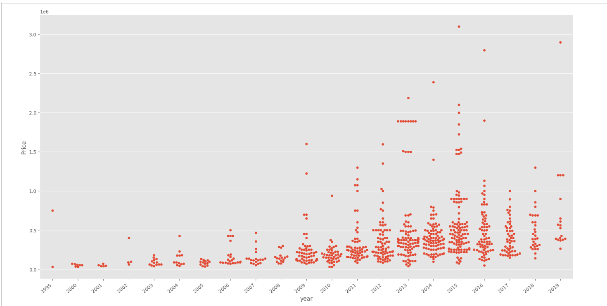
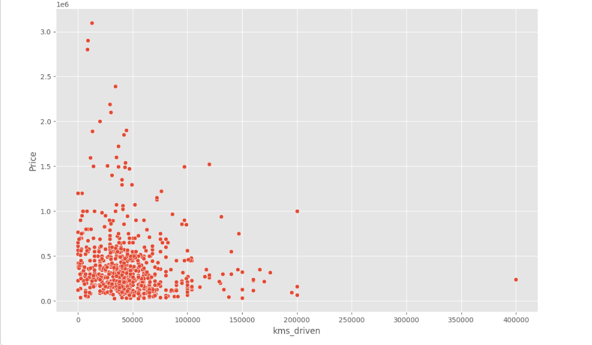
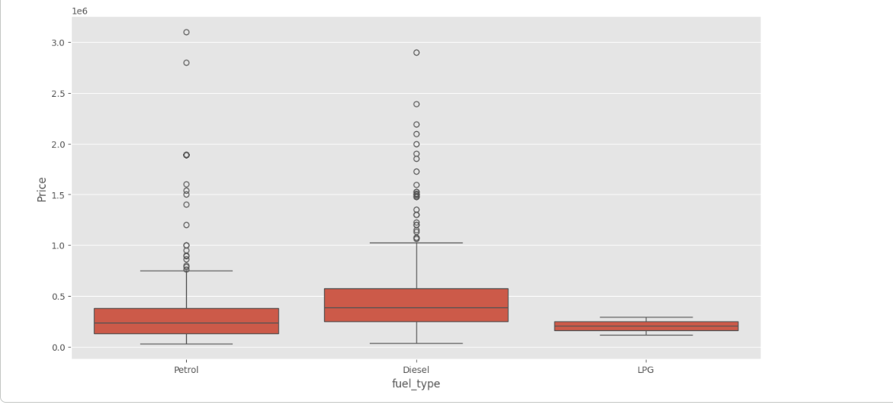
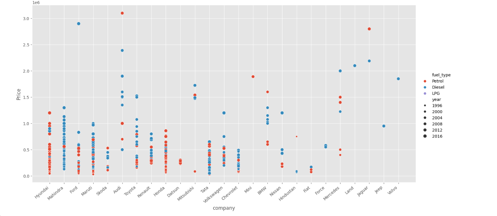

# Car Price Prediction using Machine Learning

## Project Overview

This project predicts the price of used cars using Machine Learning.

The model is trained on the Quikr Car Dataset and uses Linear Regression to estimate the selling price of a car based on various features such as car name, company, manufacturing year, kilometers driven, and fuel type.

---

## Dataset

Dataset: Quikr Car Dataset

Features:

- Car Name
- Company
- Year
- Kilometers Driven
- Fuel Type

Target:

- Price

---

## Technologies Used

- Python
- Google Colab
- NumPy
- Pandas
- Matplotlib
- Seaborn
- Scikit-Learn
- Machine Learning

---

## Machine Learning Workflow

### 1. Data Collection and Analysis

- Loaded the Quikr Car Dataset
- Explored dataset structure
- Checked missing values and data types
- Analyzed feature distributions

### 2. Data Cleaning and Preprocessing

Performed extensive data cleaning:

- Removed invalid year values
- Removed "Ask For Price" records
- Converted year column to integer
- Converted price column into numerical format
- Cleaned kilometers driven column
- Removed missing fuel type values
- Reset dataset index
- Created a cleaned dataset for training

### 3. Exploratory Data Analysis (EDA)

Analyzed relationships between important variables:

- Company vs Price
- Year vs Price
- Kilometers Driven vs Price
- Fuel Type vs Price
- Combined analysis of Company, Fuel Type and Year

### 4. Feature Engineering

Selected features:

- Name
- Company
- Year
- Kilometers Driven
- Fuel Type

Target:

- Price

Applied:

- One Hot Encoding for categorical variables
- Column Transformer
- Data Transformation Pipeline

### 5. Train-Test Split

Dataset divided into:

- Training Data
- Testing Data

### 6. Model Training

Algorithm Used:

### Linear Regression

```python
from sklearn.linear_model import LinearRegression
```

### 7. Model Evaluation

Performance Metric:

### R² Score

Initial Score:

- ~0.60

After optimization using multiple random states:

- ~0.89

### 8. Price Prediction

The trained model can predict car prices based on user inputs such as:

- Car Name
- Company
- Year
- Kilometers Driven
- Fuel Type

Example:

```python
Maruti Suzuki Swift
Maruti
2019
100 km
Petrol
```

Predicted Price:

- Approximately ₹4.3 Lakhs

---

## Data Visualization

### Company vs Price (Box Plot)

This visualization compares the price distribution across different car companies.


---

### Year vs Price (Swarm Plot)

Shows how vehicle manufacturing year affects car price.



---

### Kilometers Driven vs Price (Scatter Plot)

Illustrates the relationship between car usage and selling price.



---

### Fuel Type vs Price (Box Plot)

Compares price distributions among Petrol, Diesel and LPG vehicles.



---

### Combined Visualization

Relationship of:

- Company
- Fuel Type
- Manufacturing Year

with Car Price.



---

## Repository Structure

```text
Task-02-Car-Price-Prediction/
│
├── Car_Price_Prediction_Ananya_Hebbar.ipynb
├── quikr_car.csv
├── Cleaned_Car_data.csv
├── README.md
├── company_price_boxplot.png
├── year_price_swarmplot.png
├── kms_vs_price.png
├── fueltype_boxplot.png
└── combined_analysis.png
```

## Results

✅ Successfully cleaned and prepared real-world vehicle data

✅ Performed Exploratory Data Analysis using Seaborn and Matplotlib

✅ Applied One Hot Encoding for categorical features

✅ Built a complete Machine Learning Pipeline

✅ Trained a Linear Regression model for price prediction

✅ Achieved approximately 0.89 R² Score

✅ Successfully predicted used car prices based on user inputs

---

## Author

**Ananya Hebbar**

AI/ML Intern – InternPe
